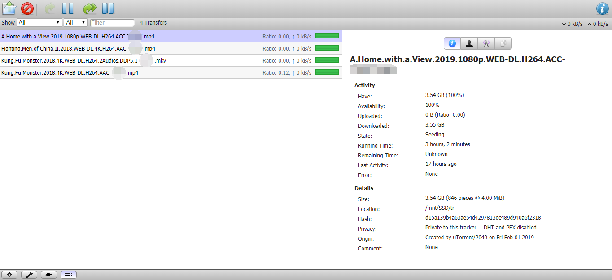
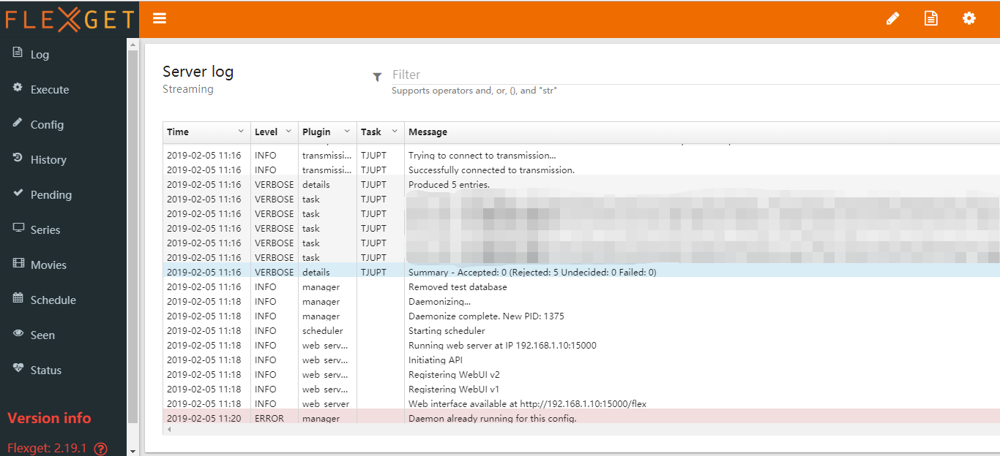

> 从笔记本上替换下的一块120G硬盘一直在闲置，今天挂载在了Raspberry Pi 3b上做PT的下载盘。安装Transsmision和Flexget以实现RSS下载功能。  
> 之后可以安装samba/vsftpd/nginx/apache2等实现更多的类似NAS的功能。  
> Transsmision是一款较为轻量的BT软件，可以跑在树莓派上做PT客户端。  
> 同时搭配Flexget和transmissionrpc插件，实现RSS自动下载功能。
 <!-- more -->

> 参考链接：  
> https://github.com/transmission/transmission/wiki  
> https://github.com/ronggang/transmission-web-control  
> https://flexget.com/Configuration  
> https://www.cnblogs.com/vipchenwei/articles/6909324.html  
> https://www.cnblogs.com/rosepotato/p/8177988.html  
> https://blog.csdn.net/yuanfang1992/article/details/77602856  
> https://www.jianshu.com/p/f4aeedbd243e  
> https://blog.whsir.com/post-1305.html  
> https://blog.csdn.net/stripe3385/article/details/50482996  
> http://www.hdpfans.com/thread-9859-1-1.html

### 无线连接局域网
配置树莓派时，我是用网线直接连接树莓派ssh登陆进行的，首先换为了树莓派无线连接路由器。

### 挂载硬盘

准备挂载笔记本上替换下来的120G SSD硬盘，首先删除之前作为windows系统盘的分区，重新分区。

> 分区工具fdisk命令参数介绍：
>   - p：打印分区表。  
>   - n：新建一个新分区。  
>   - d：删除一个分区。  
>   - q：退出不保存。  
>   - w：把分区写进分区表，保存并退出。  

```
pi@raspberrypi:~ $ sudo fdisk /dev/sda

Welcome to fdisk (util-linux 2.29.2).
Changes will remain in memory only, until you decide to write them.
Be careful before using the write command.


Command (m for help): d
Partition number (1-3, default 3): 3

Partition 3 has been deleted.

Command (m for help): d
Partition number (1,2, default 2): 2

Partition 2 has been deleted.

Command (m for help): d
Selected partition 1
Partition 1 has been deleted.

Command (m for help): n
Partition number (1-128, default 1): 
First sector (34-234441614, default 2048): 
Last sector, +sectors or +size{K,M,G,T,P} (2048-234441614, default 234441614): 

Created a new partition 1 of type 'Linux filesystem' and of size 111.8 GiB.
Partition #1 contains a vfat signature.

Do you want to remove the signature? [Y]es/[N]o: y

The signature will be removed by a write command.

Command (m for help): w
The partition table has been altered.
Calling ioctl() to re-read partition table.
Syncing disks.

```

接下来新建目录并挂载：
```
pi@raspberrypi:~ $ sudo fdisk -l

Disk /dev/sda: 111.8 GiB, 120034123776 bytes, 234441648 sectors
Units: sectors of 1 * 512 = 512 bytes
Sector size (logical/physical): 512 bytes / 512 bytes
I/O size (minimum/optimal): 512 bytes / 512 bytes
Disklabel type: gpt
Disk identifier: 156FCC52-6CAB-44B9-AF13-224A95194BEC

Device     Start       End   Sectors   Size Type
/dev/sda1   2048 234441614 234439567 111.8G Linux filesystem

pi@raspberrypi:~ $ sudo mkdir /mnt/SSD
pi@raspberrypi:~ $ sudo mount /dev/sda1 /mnt/SSD
```

### 检查软件源并更新

- 编辑/etc/apt/sources.list文件：`sudo nano /etc/apt/sources.list`  
- 注释掉官方源，替换为国内源，我使用了清华的镜像源：
```
deb http://mirrors.tuna.tsinghua.edu.cn/raspbian/raspbian/ stretch main contrib non-free rpi
deb-src http://mirrors.tuna.tsinghua.edu.cn/raspbian/raspbian/ stretch main contrib non-free rpi

```
- 接下来执行apt更新：
```
sudo apt-get update
sudo apt-get upgrade
```

### 安装transsmission-daemon

- apt安装：`sudo apt-get install transmission-daemon`  
- 默认配置目录清单：

Item|Loccation 
--|--
启动初始化脚本|/etc/init.d/transmission-daemon
基本配置文件|/etc/default/transmission-daemon
详细配置文件目录|/var/lib/transmsision-daemon/info
下载存储目录|/var/lib/transmission-daemon/downloads

- 修改配置文件：`/etc/transmission-daemon/settings.json`  
- 配置文件的详细wiki：[EditingConfigurationFiles](https://github.com/transmission/transmission/wiki/Editing-Configuration-Files)  
- 主要配置项：

```
- Bandwidth
    - alt-speed-enabled: Boolean
    - alt-speed-up: Number (KB/s, default = 50)
    - alt-speed-down: Number (KB/s, default = 50)
    - speed-limit-down: Number (KB/s, default = 100)
    - speed-limit-down-enabled: Boolean (default = false)
    - speed-limit-up: Number (KB/s, default = 100)
    - speed-limit-up-enabled: Boolean (default = false)
- Files and Locations
    - download-dir
    - incomplete-dir
    - incomplete-dir-enabled: Boolean (default = false)
- Misc
- Peers
    - peer-limit-global: Number (default = 240)
    - peer-limit-per-torrent: Number (default = 60)
- Peer Port
- Queuing
    - download-queue-enabled
    - download-queue-size: Number (default = 5)
    - seed-queue-enabled: Boolean (default = false)
    - seed-queue-size
- RPC
    - rpc-authentication-required: Boolean (default = false)
    - rpc-enabled: Boolean (default = true)
    - rpc-host-whitelist-enabled: Boolean (default = true. Added in v2.93)
    - rpc-password: String
    - rpc-port: Number (default = 9091)
    - rpc-url: String (default = /transmission/. Added in v2.2)
    - rpc-username: String
    - rpc-whitelist-enabled: Boolean (default = true)
- Scheduling
```

### 启动transsmission-daemon

首先重新加载修改过的配置文件，然后重新启动
```
sudo service transmission-daemon start # 启动
sudo service transmission-daemon stop # 停止
sudo service transmission-daemon reload # 重新加载配置文件
sudo service transmission-daemon restart # 重新启动
```

在浏览器中访问 IP 加 9091端口即可访问web端，比如： http://192.168.1.100:9091/ 。访问时输入RPC设置的认证用户名和密码。



### 使用[Transmission Web Control](https://github.com/ronggang/transmission-web-control)

> TWC 只是一套 Transmission 的 WebUI。  
> 本项目主要目的是想加强 Transmission 在 Web 方面的操作能力。
> 本项目设计之初仅针对PT站，可能有些功能对于普通BT种子而言有点水土不服，作者正在想办法加以改进。

- 中文wiki请参考[Transmission Web Control Wiki](https://github.com/ronggang/transmission-web-control/wiki/Linux-Installation-CN)  
- 安装过程：  
  - 获取最新的安装脚本：`wget https://github.com/ronggang/transmission-web-control/raw/master/release/install-tr-control-cn.sh`
  - 执行安装脚本：`bash install-tr-control-cn.sh`
  - 安装完成后，用浏览器访问 Transmission Web Interface（如：http://192.168.1.1:9091/ ）即可看到新的界面；如果无法看到新界面，可能是浏览器缓存了，请按 Ctrl + F5 强制刷新页面或 清空缓存 后再重新打开。


- 遇到的问题：
  树莓派直接下载github的release文件速度很慢，所以最好利用代理下载好放在temp文件夹内，使其自动识别后安装，省去下载步骤。
  - 下载好最新版release：`v1.6.0-beta2.tar.gz`，注意命名，去掉v1.6.0之前的部分。
  - sh文件中定义了temp文件夹是`TMP_FOLDER="/tmp/tr-web-control"`，所以将压缩包放在`/tmp/tr-web-control`。
  - 之后再执行`bash install-tr-control-cn.sh`，会提示`\nv1.6.0-beta2.tar.gz  已存在，是否重新下载？（y/n）`，输入`n`回车即可直接开始安装。
  - 请保证`v1.6.0-beta2.tar.gz`的完整性，如果是之前下载失败的安装包，可能会出现显示不全等问题。

### 安装flexget

[Flexget](https://flexget.com) 基于Python开发，所以需要先安装Python，官方给出的建议是Python 2.7 / Python 3.3-3.5，如果使用Deluge则只能使用 Python 2.7。

- 准备工作
```
python -v #查看目前系统已有的 Python 版本
apt-get install python2.7 #举例：安装 Python 2.7
apt-get install python-pip #安装 Python 包管理 pip
pip install --upgrade pip  #更新 pip
pip install --upgrade setuptools  #升级至最新的setuptools 以避免出现未知问题
```

- 安装与配置
```
pip install flexget # 全局安装 Flexget
pip install transmissionrpc # 安装transmissionrpc插件
mkdir /root/.flexget # 创建配置目录
mkdir /path/of/your/torrents/download-dir/ # 创建种子下载目录
cd ~/.flexget 
nano config.yml # 创建并编辑配置文件 config.yml
```

必须遵循 YAML 格式，子项比所属父项多缩进两个半角空格

[本人的配置文件](https://gist.github.com/greedbob/e34a27de43f8035233b0b83917d68861)：https://gist.github.com/greedbob/e34a27de43f8035233b0b83917d68861
注意替换其中的下载地址/端口/RPC信息/RSS链接等

[官方配置详解](https://flexget.com/Configuration)：https://flexget.com/Configuration

- 测试配置文件
```
flexget check # 验证flexget配置文件是否有错误，如果有错会指出错误在哪一行
flexget --test execute # 执行RSS测试，不会下载任何文件到硬盘
flexget execute # 运行flexget，同时在终端会显示log

```

- 运行
```
flexget web passwd password # 设置web后台密码，将password替换为需要设置的密码
flexget daemon start # 开始运行
```

- 添加开机自启动
```
nano /etc/rc.local  #编辑 rc.local 脚本，在 exit 0 前添加
flexget daemon start -d
```

- 访问web端
`http(s)://yourip:port/flex` 访问可以看到web后台
`ps -aux | grep flexget`可以看到flexget进程


